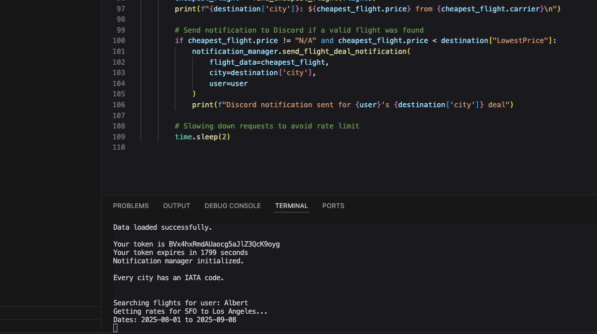

# Flight Price Monitor
A Python-based flight tracking application that monitors flight prices and sends notifications when deals are found. The application uses the Amadeus API to search for flights and Discord webhooks to send notifications.

## Features
- Multi-User Support : Track flight deals for multiple users with personalized preferences
- Multiple Destinations : Monitor prices for multiple destinations per user
- Customizable Origin Cities : Set different departure airports for each destination
- Direct Flight Option : Search for non-stop flights only
- Flexible Date Ranges : Specify custom departure and return dates for each destination
- Price Alerts : Receive notifications when flights drop below your target price
- Discord Notifications : Get real-time alerts via Discord when deals are found
## How It Works
1. The application loads destination data from a JSON file containing user preferences
2. It automatically retrieves IATA codes for cities if they're missing
3. For each user and destination, it searches for flights using the Amadeus API
4. When a flight price drops below the user's target price, it sends a notification via Discord
5. All flight data is tracked and can be analyzed for historical price trends
## Setup Requirements
### Environment Variables
The application requires the following environment variables in a .env file:

- AMADEUS_KEY : Your Amadeus API key
- AMADEUS_SECRET : Your Amadeus API secret
- DISCORD_URL : Discord webhook URL for notifications
### Data Structure
Flight destinations and preferences are stored in Flight_historical.json with the following structure:

```
{
  "UserName": [
    {
      "id": 1,
      "og city": "SFO",
      "city": "Destination",
      "iataCode": "DST",
      "dep_date": "2025-08-01",
      "ret_date": "2025-09-08",
      "LowestPrice": 500
    }
  ]
}
```
## Usage
Host the script with your preferred provider to get updates if there's any price change.

Run the application with:

```
python main.py
```
For scheduled execution, you can set up a cron job (on Unix-based systems)


The application will:

1. Load user and destination data
2. Update any missing IATA codes (if any)
3. Search for flights matching your criteria
4. Send Discord notifications for any deals found
## Limitations
Currently, it can only track all flights being non-stop or with stops at the time. By default, all flights are non-stop.

To change this setting and include flights with stops:

1. Open the file flight_search.py
2. Find the check_flights method
3. Locate the parameter "nonStop": "true"
4. Change it to "nonStop": "false" to include flights with stops

## Troubleshooting
### Common Issues
- API Rate Limiting : If you encounter rate limit errors, try increasing the sleep time between requests
- Authentication Errors : Verify your Amadeus API credentials in the .env file
- Missing Flight Data : Ensure the IATA codes in your JSON file are correct
## Dependencies
- requests: For API calls
- discord.py: For Discord webhook integration
- python-dotenv: For environment variable management
- 

